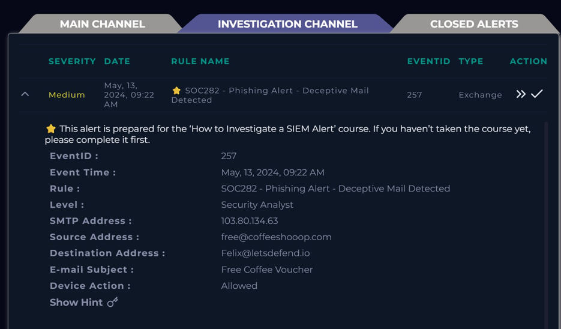
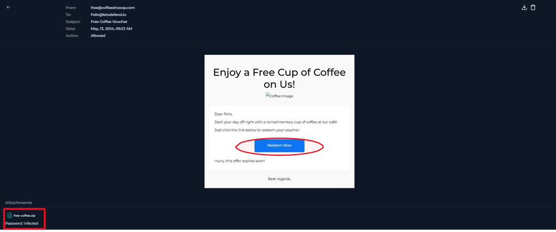
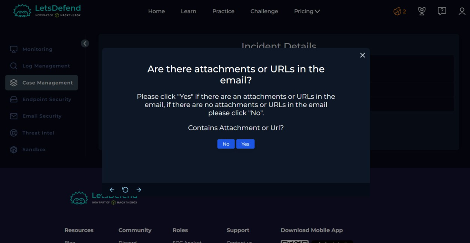
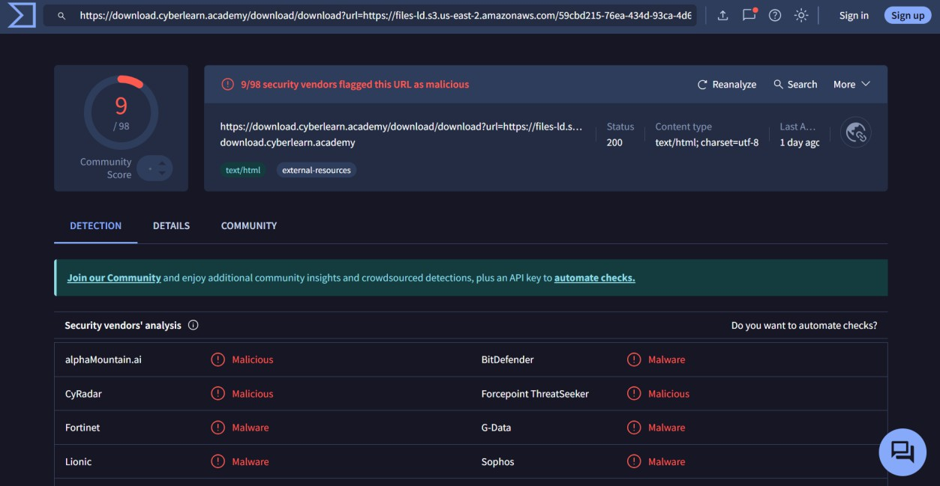
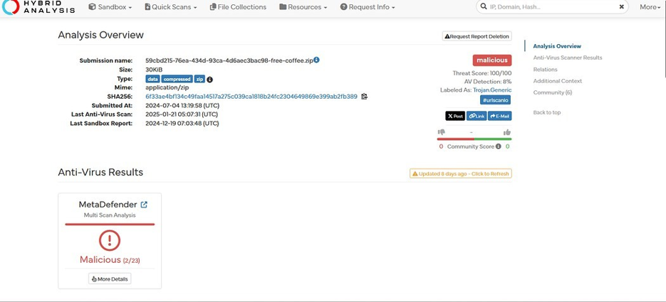
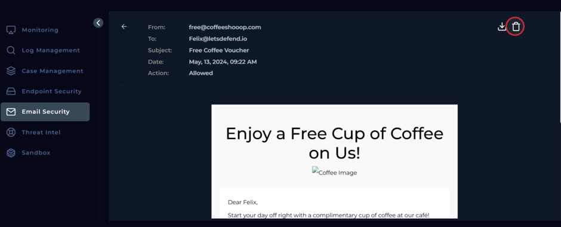
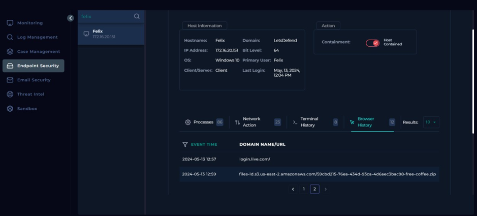
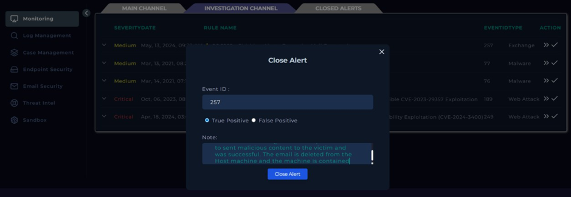

# SOC282 - Phishing Alert - Deceptive Mail Detected

## Overview
> In this room, I investigated a phishing alert on LetsDefend involving a deceptive "free coffee voucher" email sent to a user. The investigation involved parsing the suspicious email, analyzing the attached malicious URL/attachment on VirusTotal and Hybrid Analysis, checking delivery and execution on the endpoint, and following the SOC playbook through containment and closure.

---

## Scenario
> A medium-severity alert was triggered in the Exchange environment after an email offering a "free coffee voucher" was delivered to a user named Felix. The email came from an external, suspicious-looking domain and contained both a link and a password-protected zip attachment, prompting a full phishing investigation using the SOC playbook.

---

# Investigation

## 1. Parsing the Email Alert
Before starting any technical analysis, the first step of the playbook is to gather basic details about the incoming email to establish context.

### Query
```
Alert Details Reviewed:
- Event Time: May 13, 2024, 09:22 AM
- SMTP Address: 103.80.134.63
- Sender: free@coffeeshooop.com
- Recipient: Felix@letsdefend.io
- Subject: Free Coffee Voucher
- Device Action: Allowed
```

### Why this query?
- Reviewing the raw alert metadata is the first step in any email-based investigation.
- It helps establish a timeline, identify sender/recipient, and immediately flags a lookalike/spoofed domain ("coffeeshooop.com").
- The "Device Action: Allowed" value is a key indicator that the email bypassed initial filtering and reached the inbox.

### Finding
The sender domain closely mimics a legitimate brand but is misspelled ("coffeeshooop.com"), a classic typosquatting technique. The email was allowed through security controls, meaning it reached the recipient's mailbox and required manual review.

> **Evidence**
>
>

---

## 2. Analyzing Email Content and Attachments
With sender/recipient context established, the next step is to inspect the actual email body for social engineering indicators and check for attachments or embedded links.

### Query
```
Email Body Reviewed:
- Subject: "Enjoy a Free Cup of Coffee on Us!"
- CTA Button: "Redeem Now" (embedded malicious link)
- Urgency phrase: "Hurry, this offer expires soon!"
- Attachment: free-coffee.zip [password protected]
```

### Why this query?
- Reading the email content helps identify classic phishing/social engineering tactics: enticing offers, urgency, and a call-to-action link.
- Checking for attachments is a mandatory playbook step, since malicious payloads are often delivered via zip files to evade detection.

### Finding
The email used a fake incentive (free coffee) combined with urgency language to pressure the recipient into clicking the link. It also contained a password-protected zip file named `free-coffee.zip`, a common technique used to bypass email attachment scanning.

> **Evidence**
>
> 
---

## 3. Checking for Attachments/URLs via Playbook
The playbook requires a direct yes/no determination on whether the email contains any attachments or URLs, which dictates the next branch of the investigation.

### Query
```
Playbook Step: "Are there attachments or URLs in the email?"
Answer: Yes
```

### Why this query?
- This decision point in the playbook ensures analysts don't skip sandboxing or reputation-checking steps when malicious content is present.
- Confirming both an attachment and a URL exist means both need to be independently analyzed.

### Finding
The email contained both an embedded "Redeem Now" URL and a zip attachment, requiring further analysis in third-party threat intelligence tools before proceeding.

> **Evidence**
>
> 

---

## 4. Threat Intelligence Analysis (VirusTotal & Hybrid Analysis)
To confirm malicious intent, the extracted URL and attachment hash were submitted to reputable threat intelligence platforms.

### Query
```
VirusTotal:
URL: https://download.cyberlearn.academy/download/download?url=https://files-id.s3.us-east-2.amazonaws.com/59cbd215-76ea-434d-93ca-4d6aec3bac98-free-coffee.zip
Result: 9/98 vendors flagged as malicious

Hybrid Analysis:
File: free-coffee.zip
SHA256: 6f33ae4bf134c49faa14517a275c039ca1818b24fc2304649869e399ab2fb389
Verdict: Malicious (Threat Score 100/100, Labeled as TrojanGeneric)
```

### Why this query?
- VirusTotal aggregates multiple antivirus engine verdicts, giving quick community-driven confidence on whether a URL/file is malicious.
- Hybrid Analysis provides sandbox detonation results and a threat score, which is more reliable for confirming behavior-based malware classification (e.g., Trojan activity).

### Finding
Both the URL and the attached zip file were independently confirmed as malicious. The zip file was classified as a generic Trojan with a maximum threat score, confirming this was a real malware delivery attempt disguised as a promotional email.

> **Evidence**
>
> 
> 

---

## 5. Verifying Email Delivery Status
Since the alert showed "Device Action: Allowed," it was necessary to confirm through the Email Security module whether the email actually reached the user's mailbox.

### Query
```
Email Security Page Search: free@coffeeshooop.com
Result: Final Action = Allowed
```

### Why this query?
- Confirming delivery status is critical to determine the urgency of remediation — a blocked email requires no further user-facing action, while a delivered one requires cleanup and user notification.
- This step directly informs whether "Delivered" or "Not Delivered" should be selected in the playbook.

### Finding
The Email Security console confirmed the final action was "Allowed," meaning the phishing email successfully reached Felix's mailbox and needed to be manually removed.

> **Evidence**
>
> 

---

## 6. Removing the Malicious Email
Once delivery was confirmed, the malicious email needed to be deleted from the recipient's mailbox to prevent further interaction.

### Query
```
Action Taken: Navigate to Email Security > Open Email > Delete
```

### Why this query?
- Deleting the email is a standard containment action to stop the user or others from re-opening/re-triggering the malicious link or attachment.
- This directly reduces the chance of secondary infection or repeated clicks.

### Finding
The phishing email was successfully deleted from Felix's mailbox via the Email Security module, completing the immediate remediation of the delivery vector.

> **Evidence**
>
> 

---

## 7. Checking Endpoint Activity for Malicious File/URL Execution
To assess the real-world impact, it was necessary to check whether the user actually interacted with the malicious link or file on their endpoint.

### Query
```
Endpoint Security > Search: Felix (172.16.20.151)
Browser History Reviewed:
2024-05-13 12:59 - files-id.s3.us-east-2.amazonaws.com/.../free-coffee.zip
```

### Why this query?
- Reviewing browser/network history on the endpoint confirms whether the phishing link was actually clicked, moving the incident from "potential" to "confirmed" compromise.
- This step is essential for scoping the actual impact of the attack rather than assuming based on delivery alone.

### Finding
The endpoint logs confirmed that Felix accessed the malicious URL and downloaded the file, meaning user interaction did occur and the host needed to be treated as potentially compromised.

> **Evidence**
>
> *

---

## 8. Containing the Infected Host
With confirmed execution/access, the infected endpoint needed to be isolated to prevent lateral movement or further compromise.

### Query
```
Endpoint Security > Felix's Host > Containment: Enabled
Status: Host Contained
```

### Why this query?
- Isolating the compromised host is a critical containment step to stop malware from spreading across the network or communicating with a C2 server.
- This action limits the blast radius while further forensic analysis or remediation can occur.

### Finding
The host was successfully isolated (contained), preventing any further network communication and stopping potential lateral spread of the threat.

> **Evidence**
>
> 

---

## 9. Documenting Artifacts and Closing the Case
The final playbook steps involve recording indicators of compromise (IOCs) and documenting analyst findings before formally closing the alert.

### Query
```
Artifacts Added:
- free@coffeeshooop.com (Type: Email Sender)
- files-id.s3.us-east-2...free-coffee.zip (Type: URL Address)

Analyst Note:
"This is a phishing email. The attacker with email address 
'free@coffeeshooop.com' tried to send malicious content to the victim 
and was successful. The email is deleted from the host machine and 
the machine is contained."

Alert Closed As: True Positive
```

### Why this query?
- Logging artifacts (sender, malicious URL) builds organizational threat intelligence and helps detect repeat attacks from the same source.
- Writing a clear analyst note ensures other team members understand what happened and what actions were taken, supporting audit and reporting needs.
- Closing the alert as "True Positive" correctly classifies the incident for metrics and future correlation.

### Finding
The case was documented with relevant IOCs and closed as a True Positive, reflecting a confirmed phishing attack that was successfully contained after user interaction.

> **Evidence**
>
> 

---

# Skills Practiced
- Phishing Email Analysis
- SOC Playbook Execution
- Threat Intelligence Lookup (VirusTotal, Hybrid Analysis)
- Email Security Investigation
- Endpoint Security & Host Containment
- Incident Documentation & Artifact Collection

---

# Conclusion
> This room helped me practice a full end-to-end phishing investigation workflow using a SOC playbook, from initial email triage to threat intelligence validation, endpoint verification, and host containment. I learned how to confirm malicious indicators using tools like VirusTotal and Hybrid Analysis, verify real-world impact through endpoint browser history, and properly document and close an incident as a true positive.